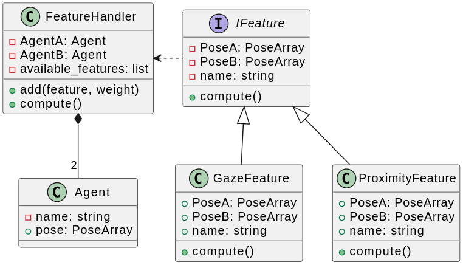
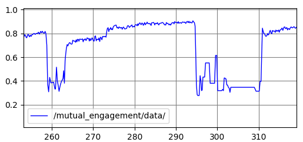

# GRACE - GeometRic ApproaCh to mutual Engagement

Python module to estimate mutual engagement given the pose in space of the relevant features of the social agents (human and robot).
The project follows the abstract factory design pattern, so adding a new relevant feature result in inheriting from the class IFeature and implement a custom `compute` function.

[Codacy](https://app.codacy.com/gh/vignif/grace/dashboard) is used to track the quality of the code.

[](https://www.codacy.com/gh/vignif/grace/dashboard?utm_source=github.com&amp;utm_medium=referral&amp;utm_content=vignif/grace&amp;utm_campaign=Badge_Grade)




## How to install

Create and activate a new python environment with:

```bash
python3 -m venv venv_grace
source venv_grace/bin/activate
```

Clone this repository and install the package in the `venv_grace` environment

```bash
git clone git@github.com:vignif/grace.git
pip setup.py install
```

## Minimal usage example

```
from grace import Agent, run_default

# The second argument of Agent is the position and orientation (quaternion) of the agent wrt the world
A = Agent("name social agent A", ([0, 0, 0]), ([0, 0, 0, 1]))
B = Agent("name social agent B", ([1, 1, 0]), ([0, 0, 0, 1]))
eng = run_default(A, B)
```

## Ros wrapper

A wrapper for ros noetic is available at [https://github.com/vignif/grace_ros](https://github.com/vignif/grace_ros)

Once properly configured, the mutual engagement is retrieved by the ros topic `\mutual_engagement`.

The following figure shows an example of such information.


## Tests

[](https://github.com/vignif/grace/actions/workflows/ci_test_grace.yml)

[](https://www.codacy.com/gh/vignif/grace/dashboard?utm_source=github.com&utm_medium=referral&utm_content=vignif/grace&utm_campaign=Badge_Coverage)
